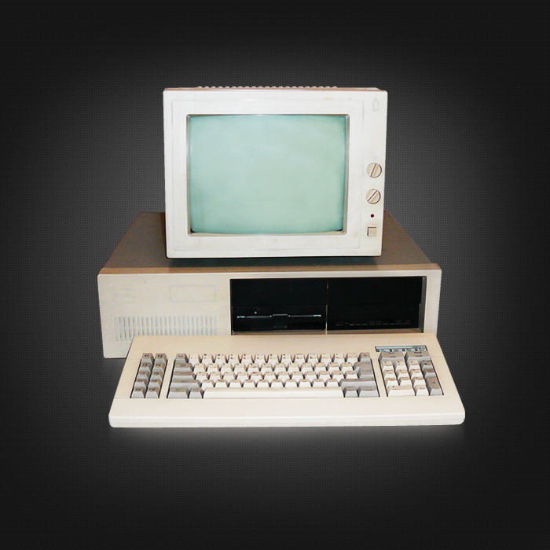
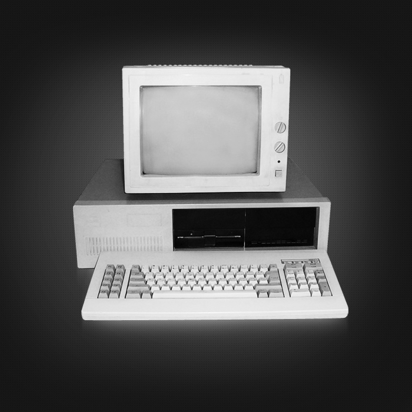

# Azure Blob Trigger Function - Graustufenbilder

## Projektbeschreibung

Dieses Projekt zeigt eine Azure Function mit Blob Trigger.
Wenn ein Bild in den Blob-Container `farbbilder` hochgeladen wird, startet die Function automatisch.
Das Bild wird mit SkiaSharp verarbeitet, in ein Graustufenbild umgewandelt und anschließend im Container `graubilder` gespeichert.

## Verwendete Technologien

* C#
* .NET 8 isolated worker
* Azure Functions
* Azure Blob Storage
* Blob Trigger
* Blob Output Binding
* SkiaSharp
* Azure CLI
* Visual Studio

## Azure-Ressourcen

Für diese Aufgabe wurden folgende Azure-Ressourcen verwendet:

* Resource Group: `BlobTriggerRG`
* Storage Account: `dmblobtrigger2026`
* Input Container: `farbbilder`
* Output Container: `graubilder`
* Azure Function Projekt: `BlobTriggerFunction`

## Funktionsweise

1. Ein farbiges Bild wird in den Container `farbbilder` hochgeladen.
2. Der Blob Trigger erkennt die neue Datei automatisch.
3. Die Azure Function liest das Bild als `byte[]`.
4. Das Bild wird mit SkiaSharp als `SKBitmap` geöffnet.
5. Jeder Pixel wird gelesen.
6. Aus den RGB-Werten wird ein Grauwert berechnet.
7. Der Pixel wird durch einen neuen Graustufen-Pixel ersetzt.
8. Das fertige Bild wird als JPG-Datei gespeichert.
9. Das Ergebnis wird im Container `graubilder` abgelegt.

## Wichtiger Hinweis zur Konfiguration

Die Datei `local.settings.json` enthält normalerweise den Connection String zum Azure Storage Account.
Aus Sicherheitsgründen wird kein echter Connection String in GitHub veröffentlicht.

In diesem Projekt steht dort nur ein Platzhalter:

```json
"AzureWebJobsStorage": "HIER_CONNECTION_STRING_EINFÜGEN !!!"
```

Für die lokale Ausführung muss der eigene Azure Storage Connection String eingetragen werden.

## Beispiel für den Blob Trigger

```csharp
[BlobTrigger("farbbilder/{name}", Connection = "AzureWebJobsStorage")]
```

Dieser Trigger reagiert auf neue Dateien im Container `farbbilder`.

## Beispiel für das Output Binding

```csharp
[BlobOutput("graubilder/grau-{name}", Connection = "AzureWebJobsStorage")]
```

Das Ergebnis wird im Container `graubilder` gespeichert.

## PowerShell / Azure CLI

Für die Erstellung und Prüfung der Azure-Ressourcen wurden Azure CLI Befehle verwendet.
Der verwendete PowerShell-Code befindet sich später im Ordner `Scripts`.

## Screenshots

### Farbbild im Eingangscontainer

Das folgende Bild wurde in den Blob-Container `farbbilder` hochgeladen.



### Graustufenbild im Ausgangscontainer

Nach dem Upload wurde die Azure Function automatisch durch den Blob Trigger gestartet.
Das Bild wurde verarbeitet und als Graustufenbild im Container `graubilder` gespeichert.




## Ergebnis

Die Aufgabe wurde erfolgreich umgesetzt.
Ein farbiges Bild wird automatisch durch eine Azure Function verarbeitet und als Graustufenbild in einem zweiten Blob-Container gespeichert.
